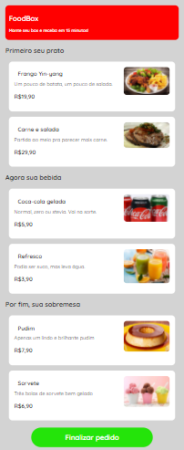

# Driven FoodBox

Esse projeto foi desenvolvido a partir do minicurso [Como fazer seu próprio Ifood](https://www.youtube.com/playlist?list=PLJDXut-jHGUtYjl9XqoZyxbMVdMtOvZd9) pela Driven Education

## Table of contents

- [Resumo](#resumo)
  - [O minicurso](#o-minicurso)
  - [Screenshot](#screenshot)
- [Autor](#autor)

## Resumo

### O minicurso

Nesse minicurso foi desenvolvido uma interface de um site para o pedido de delivery de comidas. Os usuários ao acessar o site devem ser capazes de:

- Visualizar todas as opções disponíveis no estabelecimento
- Selecionar uma das opções em cada seção 
- Finalizar o pedido
- Enviar o pedido por whatsapp para o estabelecimento

## Screenshot

## Autor

- [Github](https://github.com/tamiresataide)
- [Linkedin](https://www.linkedin.com/in/tamiresataide/)
- Frontend Mentor - [@tamiresataide](https://www.frontendmentor.io/profile/tamiresataide)
